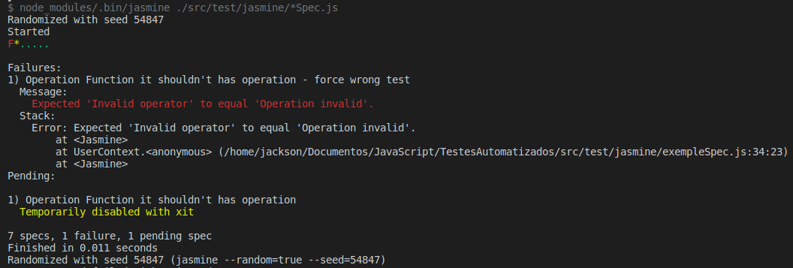
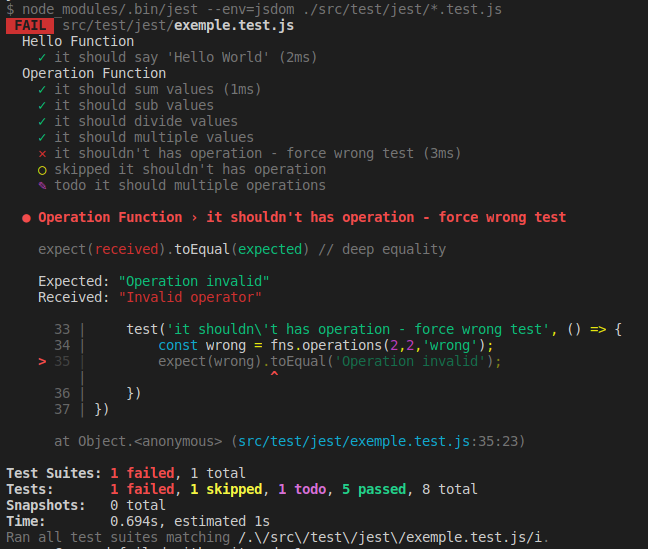
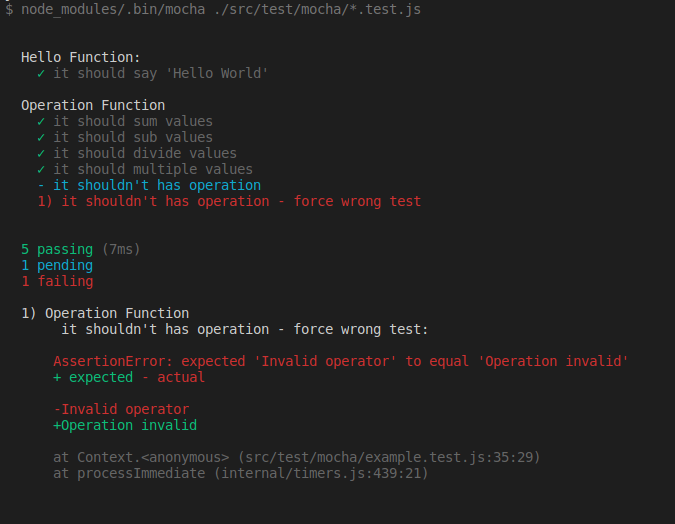

# JavaScript Automation Example

This repository destiny to present a simple dashboard with 3 (three) differents tests frameworks: Mocha + Chai, Jest and Jasmine.

## Run locally

### Prerequisites
- Node.js

### Steps
1. `npm install`
2. `npm test`

After this the execution present 3 (three) diferentes errors, in order to demonstrate the dashboards of the frameworks and their functionalities.

## Example

* `Jasmine`

  

* `Jest`

  

* `Mocha + Chai`

  

